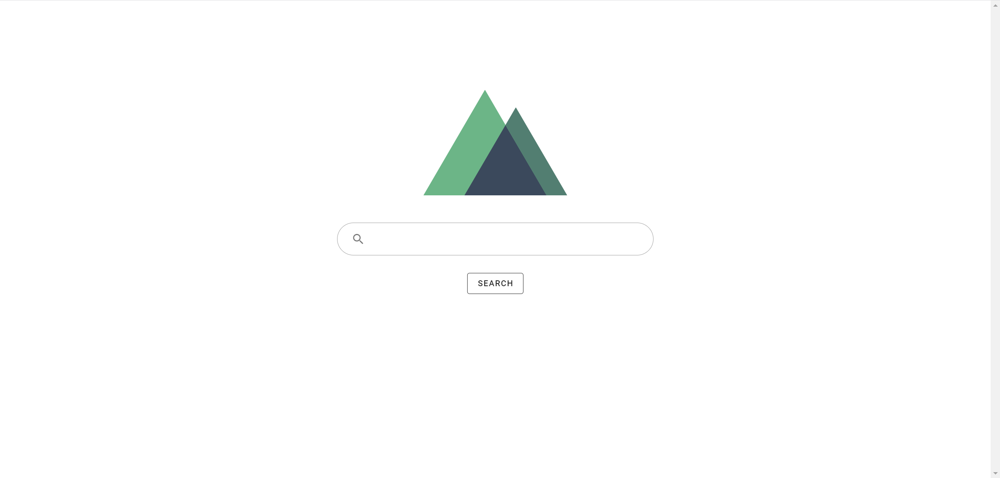

# 图片搜索引擎实验报告

乐阳      计84

谢云桐  计83  2018011334


## 问题描述

#### 背景

本项目使用 [Open Image Dataset V6](https://storage.googleapis.com/openimages/web/index.html) 中的验证集（validation split），共 41620 张图片，大小约 12 G，在此之上搭建图片搜索引擎。由于该数据集中图片分布较为多样，不便于测试以图搜图的性能，同时该数据集中绝大部分图片都有人工和机器标注的分类标签，对文字搜索较为友好，因此本项目使用文字作为查询词。

#### 问题描述

用户在前端界面中给定数个英文单词（或一句话），搜索引擎在数据集中搜索与其相关的图片并依据综合相关度进行排序后，返回前端展示给用户。同时作为附加功能，支持按照图片的尺寸、颜色进行筛选展示搜索结果，支持中文搜索，并在用户浏览图片详情时进一步搜索与该图片相似的图片。


## 实现模块

本项目可以粗略地分为以下三个模块

- 数据预处理：下载数据，建立索引
- 网站后端：处理请求，搜索排序
- 网站前端：用户交互

模块关系图如下：


### 实现细节

#### 数据预处理

#### 网站前端

- 使用 Vue.js 作为基础框架，编写逻辑
- 使用 Nuxt.js 创建服务端渲染应用，也可以静态部署
- 使用 Vuetify 绘制 UI

UI 设计上参考了 Google Image Search，简约美观，交互逻辑自然

- 主页

  

  简约风格，只有 logo、搜索框和搜索按钮，支持回车查询

- 结果展示页

  

  

  最顶部为应用工具栏，点击 logo 返回主页，可在搜索框中输入内容后回车查找，点击漏斗图标后弹出筛选对话框

  主体部分展示搜索结果，考虑流畅度，此处展示缩略图，可以单机进入图片详情对话框，每张图下方放置指向原网页的链接（因数据集中没有该信息，所以暂时为占位符）

  底部显示搜索结果数、搜索请求计时，实现翻页

- 筛选对话框

  

  选择筛选规则，大小使用选项，颜色在选中 Pick color 时会出现调色盘进行颜色选择

- 图片详情对话框

  

  展示图片详情，相比结果展示页的信息，加入图片描述（如原网站中与搜索词匹配的文段）并使用高清大图，下方展示 20 张相似图片

- 错误页面

  

  展示出错信息，可继续进行搜索/返回主页

#### 网站后端

## 关键功能

### 图片搜索

#### 基础搜索

#### 条件筛选

#### 中文搜索

### 相似推荐


## 测试结果

### 图片搜索

选择查询词进行搜索，计算相应的评价指标，注意“耗时”指前端发出请求到返回的耗时，包括网络传输时间、后端检索时间

| 查询词 | AP@20 | P@10 | Success@10 | RR   | 耗时（ms） |
| ------ | ----- | ---- | ---------- | ---- | ---------- |
|        |       |      |            |      |            |
|        |       |      |            |      |            |
|        |       |      |            |      |            |
|        |       |      |            |      |            |

总体 MAP、P@10、MRR

### 颜色筛选

尺寸筛选必然准确，设计尺寸时分布也较为平均，性能分布没有意义，因此跳过

| 查询词 | 颜色（RGB） | AP@20 | P@10 | Success@10 | RR   | 耗时（ms） |
| ------ | ----------- | ----- | ---- | ---------- | ---- | ---------- |
|        |             |       |      |            |      |            |
|        |             |       |      |            |      |            |
|        |             |       |      |            |      |            |
|        |             |       |      |            |      |            |

总体 MAP、P@10、MRR

### 相似图片

| 图片id | AP@20 | P@10 | Success@10 | RR   |
| ------ | ----- | ---- | ---------- | ---- |
|        |       |      |            |      |
|        |       |      |            |      |
|        |       |      |            |      |
|        |       |      |            |      |

总体 MAP、P@10、MRR


## 样例分析

在本节均选取前8个（不翻页显示）结果进行分析

### 图片搜索

milk：


在这种简单的单词上，搜索结果除了 label 标注不合理外不会出现问题

牛奶：


同样，中文的简单词语可以完美翻译，结果也不会有问题

girl sitting on a chair near a desk：


这一查询的关键内容为 girl, chair, desk，前两个结果与我们的查询目标非常匹配，之后的结果都相对不相关，但是这是由于数据集的限制，与该查询匹配的只有这两

girl, chair, desk 都是 label，cos 相似度为 1.0，比例为 10000，on 和 a 被忽略，sitting 和 near 的相关 label 如下：

```
sitting: [('bull', 0.4546), ('seat belt', 0.4537), ('woman', 0.444)]
near: [('serving tray', 0.4517), ('common sunflower', 0.4303), ('common fig', 0.4303)]
```

可见其最高的 cos 相似度也低于 0.5，比例小于 100，我们的词向量相似度算法是非常有效的


### 颜色筛选

根据前面的实验，颜色在 "car" 这一关键词上表现最好，主要原因是 "car" 这一 label 对应图片较多，研究 "car" 在各种颜色下的结果

无颜色：


红色：


黄色：


绿色：


蓝色：


黑色：


可见在红、黄、绿、蓝等较为鲜艳，且在环境中出现较少的颜色表现较好，在这些颜色中错误结果主要来自相似色（黄6、蓝2）和相似色（黄4）。而在搜索黑色时因为其在环境中过于常见，结果并不好，如第6张图，显然是白车，但是此图中第二主要的颜色就是黑色，因此也会通过筛选器。


## 开源资料

[Django](https://docs.djangoproject.com/en/3.2/)

[Vue.js](https://vuejs.org/v2/guide/)

[Nuxt.js](https://nuxtjs.org/docs/2.x/get-started/installation)

[Vuetify](https://vuetifyjs.com/en/getting-started/installation/)


## 参考代码

[Django](https://github.com/django/django)

[Vue.js](https://github.com/vuejs/vue)

[Nuxt.js](https://github.com/nuxt/nuxt.js)

[Vuetify](https://github.com/vuetifyjs/vuetify)

[vue-loading-overlay](https://github.com/ankurk91/vue-loading-overlay)


## 小组分工

乐阳：后端、数据预处理、算法

谢云桐：前端、算法